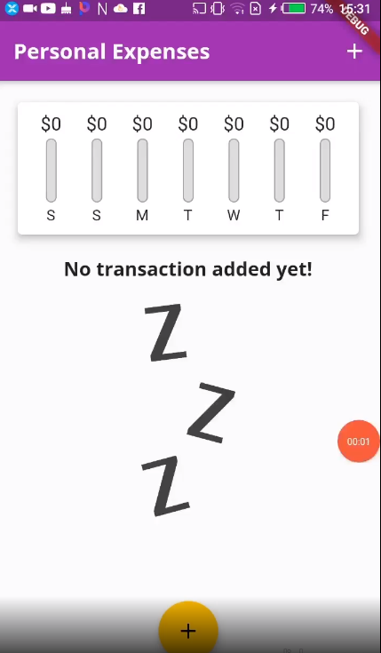

<h1 align="center">Flutter-PersonalExpensesApp</h1>
<a href="#">
  <div align="center" >
    
  </div>
</a>

## <h2 align = "center"> [Tap to see the video of this app](https://hirashahid.thecloudsoft.com/flutter-personalexpensesapp/)</h2>

## Functionalities
- [x] Adding Image and fonts 
- [x] Showing a Date Picker 
- [x] Adding Transactions with Date 
- [x] Deleting transactions 
- [x] ListTile Widget 
- [x] Flexible and Expanded
- [x] Configuring and using themes options 
- [x] Showing Model Bottom Sheet
- [x] Mapping data into widgets and splitting widgets into smaller ones
- [x] Connecting Widgets and Managing Data
- [x] Responsiveness and Adaptive
- [x] Calculate sizes dynamically
- [x] Layoutbuilder widget 
- [x] Landscape or Portrait Mode
- [x] MediaQuery Object
- [x] Using SafeArea
- [x] Cupertino Style
- [x] Custom Adaptive Widget 
- [x] Builder Methods
- [x] How Flutter works internally


## How To Run
```
git clone https://github.com/hirashahid/Flutter-PersonalExpensesApp
cd Flutter-PersonalExpensesApp
flutter run
```

## Author
You can get in touch with me on my LinkedIn Profile:

#### Hira Shahid
[](https://www.linkedin.com/in/thehirashahid)

You can also follow my GitHub Profile to stay updated about my latest projects: [](https://github.com/hirashahid)

If you liked the repo then kindly support it by giving it a star ⭐!

## LICENSE
- MIT (2021)
